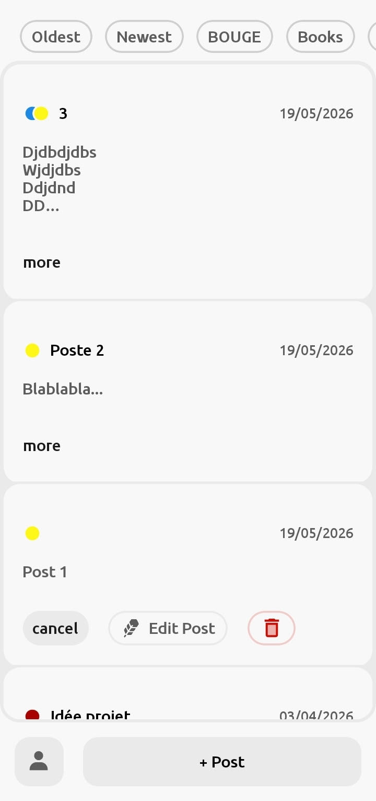

# Flow_

Flow_ est une application de prise de notes pensée pour la relecture.  
Vous écrivez, vous relisez.  
Chaque note se transforme en un post relisable, comme dans le feed d'un réseau social.

## Pourquoi avoir créé Flow_ ?

J'ai créé ce projet pour répondre à un problème que je ressentais avec les applications de prise de notes classiques : elles ne font que stocker l'information.  
Je me retrouvais avec des notes oubliées que je ne relisais jamais.

J'ai également créé cette application pour apprendre React Native, car c'est le premier projet que j'ai réalisé avec ce framework.

Pour l'installer et le modifier → [installation](./Presentation/INSTALLATION.md)

## Fonctionnalités

Dans l'application, vous pouvez :
- Prendre des notes, les modifier, les supprimer
- Lier des notes à des catégories
- Les relire dans un feed

## Stack technique

Framework **React Native** avec TypeScript, sans Expo.  
Les notes sont enregistrées en local avec une base de données **SQLite**.  
Les noms d'utilisateurs sont enregistrés via **Supabase** (fonctionnalité désactivée dans cette version publique).

Pour plus de détails techniques → [Fonctionement](./Presentation/TECHNICAL.md)
